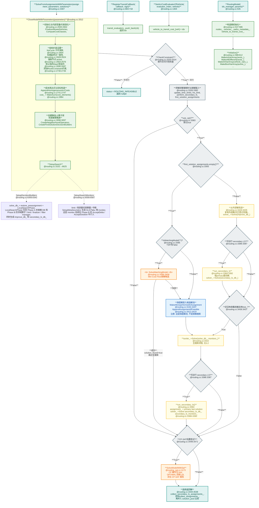
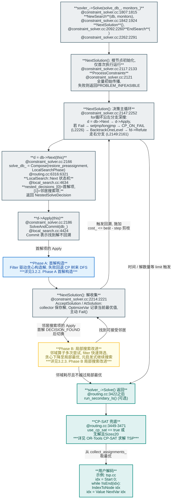
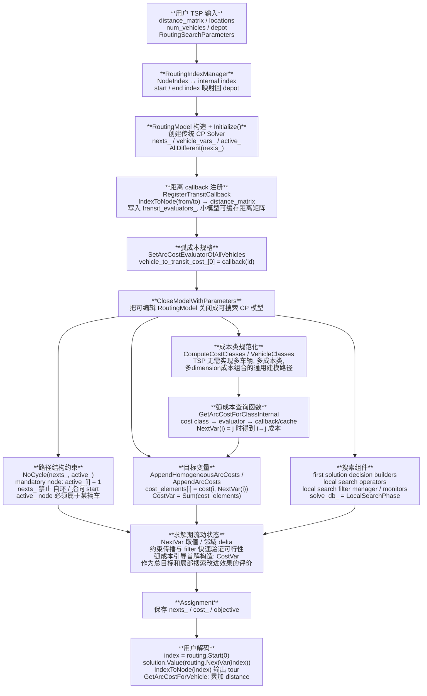

**!!! 本报告基于 [google/or-tools at 79e340fd50e1cae499bd6c9035486cf06c8261a5](https://github.com/google/or-tools/tree/79e340fd50e1cae499bd6c9035486cf06c8261a5) !!!**

# 0. 总览：传统 CP 路径求解 TSP

OR-Tools 求解 TSP 的传统路径是一个**三层架构**：

```
用户代码 (distance callback + RoutingIndexManager + RoutingModel)
        │
        V
Routing 库 (车辆路径垂直层)          ortools/constraint_solver/routing*.{h,cc}
  - 把 TSP 编码成 next/active/vehicle 变量上的约束网络
  - 提供首解启发式、路径局部搜索算子、过滤器、元启发式
        │
        V
Constraint solver (约束传播 + 回溯搜索内核)  ortools/constraint_solver/constraint_solver.{h,cc}
  - DecisionBuilder CP 搜索树, IntVar/Constraint/Demon propagation, trail 回溯
```

routing.h 的文件头注释明确说明了这一定位：

>The vehicle routing library is a vertical layer above the constraint programming library" (routing.h:33-34)

求解上以**局部搜索为主、约束传播为辅**：

>"Solving the vehicle routing problems is mainly done using approximate methods (namely local search), potentially combined with exact techniques based on dynamic programming and exhaustive tree search" (routing.h:61-65)

这一点是理解传统 CP 路径的关键：**CP 模型（变量+约束）在这里主要充当 feasibility checker 和 incremental cost evaluator，而真正驱动求优的是构造式首解启发式 + 基于过滤器的局部搜索 + 元启发式**。

# 1. TSP 建模

OR-Tools 采用 successor 模型：

$$
\begin{align}
\min \sum_i &\text{cost}_i\\
&\text{cost}_i = c_{i, \text{succ}_i} &\text{succ}_i \in V \setminus \{i\} \\
&\text{Circuit}(\text{succ}_i), & i = 1, ..., n
\end{align} 
$$

* 变量：对节点 $i$，定义整数变量 $\text{succ}_i \in \{ 0,..., n - 1 \}$ 表示从 $i$ 直接走向后续节点。比如有 5 个节点 $[0,1,2,3,4]$，$\text{succ}_0=2$ 就表示从节点 0 出发，下一个访问节点是 2。
* 约束：
	1. Circuit：所有 $\text{succ}$ 变量必须形成一个哈密顿环，约束方式通常使用 $\text{Circuit}(\text{succ}_1, ..., \text{succ}_n)$ ，保证每个节点恰好被访问一次且形成单一闭环，注意仅使用 $\text{AllDifferent}$  约束不够，因为没办法解决子环问题。
	2. cost：$\text{cost}_i$ 表示从 $i$ 到 $\text{succ}_i$ 的旅行成本。

# 2. 核心头文件

| 头文件                       | 主要功能                                                                                                   | TSP 相关性                                                         |
| ------------------------- | ------------------------------------------------------------------------------------------------------ | --------------------------------------------------------------- |
| routing.h                 | `RoutingModel` 主接口，声明 callback，成本，变量，求解，搜索配置等API                                                       | 建模和解码入口                                                         |
| routing_index_manager.h   | 维护用户节点 `NodeIndex` 与求解器变量索引的双向映射                                                                       | TSP callback 需要用 `IndexToNode()` 转换内部 index 到距离矩阵下标             |
| routing_parameters.h      | 定义 `RoutingSearchParameters`（由 protobuf 定义），局部搜索算子，搜索控制参数                                              | 第一解策略、局部搜索和 metaheuristic 选择                                    |
| routing_enums.pb.h/.proto | 定义 `FirstSolutionStrategy`、`LocalSearchMetaheuristic`、求解状态枚举                                           | TSP 常用 `PATH_CHEAPEST_ARC`、`CHRISTOFIDES`、`GUIDED_LOCAL_SEARCH` |
| constraint_solver.h       | 传统 CP 求解器，包含 `Solver`、`IntVar`、`Constraint`、`Assignment`、`DecisionBuilder`、`LocalSearchOperator` 等基础设施 | Routing Solver 通过这些 CP 语言去表达路径变量和约束                             |
| routing_search.h          | first solution heuristic、filtered heuristic、Savings、Christofides 等搜索构造                                 | 传统CP路径的第一解和部分构造式启发式                                             |
| routing_filters.h         | 局部搜索过滤器、PathState、目标过滤、CP 可行性过滤等                                                                       | TSP 邻域移动是否可接受主要靠这些过滤器判定                                         |
| constraint_solveri.h      | Routing 专用 LS 算子，如 relocate neighbors、shortest path two-opt、pair/subtrip 算子                            | TSP 主要使用 relocate、exchage、two-opt、or-opt、LK、TSPOpt、TSPLns 等路径邻域 |

# 3. 核心类层次图

```markdown
Solver  // 核心对象，负责建模工厂、传播、搜索控制和可回溯状态管理
```

```markdown
BaseObject          // 由求解器管理，大多数搜索对象的根类
├─ Decision         // 搜索树分支动作                  
├─ DecisionBuilder  // 生成搜索树   
├─ Demon            // 传播队列中的基本执行单元
```

```markdown
SearchMonitor : BaseObject      // 接受搜索生命周期回调，用于日志、限制、收集解和元启发式 
├─ SolutionCollector            // 在搜索过程中保存一或多个 Assignment 解        
├─ SearchLimit                  // 搜索停止条件的抽象基类
│  ├─ RegularLimit              // 按时间、分支数、失败数等常规指标限制搜索
│  └─ ImprovementSearchLimit    // 根据目标改善速度判断是否提前停止 
├─ BaseObjectiveMonitor         // 目标监控器的公共抽象层                 
│  └─ ObjectiveMonitor          // 维护目标值、接受准则和局部搜索优化逻辑
│     ├─ OptimizeVar            // 最基础的优化监控器，默认最小化目标 (GREEDY_DESCENT)    
│     └─ Metaheuristic          // 围绕目标值推进元启发式的局部搜索
│        ├─ TabuSearch          // 短期记录并禁止最近做过或其逆操作的移动来避免搜索循环
│        ├─ SimulatedAnnealing  // 以随温度逐步降低的概率接受劣解
│        └─ GuidedLocalSearch   // 对高代价特征施加惩罚来改变目标函数
├─ PropagationMonitor           // 观察约束传播时间，主要用于调试、跟踪和分析              
└─ LocalSearchMonitor           // 观察局部搜索事件，主要用于局部搜索调试和统计
```

```markdown
LocalSearchOperator : BaseObject      // 局部搜索邻域生成器的抽象基类
└─ IntVarLocalSearchOperator          // 面向 IntVar 数组的局部搜索算子基类
   └─ PathOperator<ignore_path_vars>  // 面向路径结构的局部搜索算子基类，是 Routing 核心
      ├─ TwoOpt                       // 反转子链，2-opt 边交换
      ├─ OrOpt (Relocate x3)          // 移动 1/2/3 节点链到同路径新位置
      ├─ LinKernighan                 // 可变长度交换链，3-opt + 迭代 2-opt
      ├─ RelocateExpensiveChain       // 重定位最贵 arc 段
      ├─ TSPOpt                       // 子链 Held-Karp 精确求解
      ├─ TSPLns                       // 随机元节点 TSP 重排
      └─ ...
```

```markdown
LocalSearchFilter : BaseObject  // 局部搜索 move 的快速可行性和增量成本过滤器基类
└─ IntVarLocalSearchFilter      // 面向 IntVar delta 的局部搜索过滤器基类
   └─ BasePathFilter            // 面向 Routing 路径变化的过滤器基类
```

```markdown
PropagationBaseObject : BaseObject  // 带 Solver* 的传播对象基类，供约束、表达式和解对象访问求解器
├─ Constraint                       // 约束基类，提供创建 demon 并执行初始化传播
├─ IntExpr                          // 整数表达式基类
│  └─ IntVar                        // 持久整数变量，支持域更新、事件监听和搜索赋值
└─ Assignment                       // 解或局部搜索 delta 的容器，变量到取值/域的映射
```

```markdown
Routing 封装层（无基类）
├─ RoutingIndexManager  // 用户节点编号和 Routing 内部变量索引之间的转换
├─ RoutingModel         // Routing 库的主要模型，封装车辆、路径变量、约束、成本和搜索
└─ RoutingDimension     // Routing 中累计量维度，描述时间、容量、距离等沿路径传播的资源
```

# 4. 变量与约束编码

## 4.1. TSP 的内部图编码

ortools constraint solver 路径并不使用经典 MILP 的 `x[i][j] in {0, 1}` 全矩阵编码。它使用 successor 变量：

```cpp
NextVar(i) = j  // 表示路径中 i 后面直接访问 j
```

对于 TSP，解为：

```cpp
Start(0) -> city_a -> city_b -> ... -> city_z -> End(0)
```

其中 `Start(0)` 和 `End(0)` 在用户节点层都映射到 depot。用户最终沿 `NextVar` 链解码出闭合 route。

## 4.2. 变量编码列表

| 变量                                            | 域/含义                               | TSP 中的作用                                             | 代码依据                                                                  |
| --------------------------------------------- | ---------------------------------- | ---------------------------------------------------- | --------------------------------------------------------------------- |
| `nexts_[i]` / `NextVar(i)`                    | `[0, size+vehicles-1]`, 表示后继 index | 核心 successor 编码, 决定 route 顺序                         | 创建见 `routing.cc:590:592`, 访问见 `routing.h:1849:1853`                   |
| `active_[i]` / `ActiveVar(i)`                 | Bool, 表示节点是否被访问                    | TSP 中所有非 end 节点 mandatory, 因此固定为1                    | 创建见 `routing.cc:598:599`, mandatory 固定见 `routing.cc:2661:2676`        |
| `vehicle_vars_[i]` / `VehicleVar(i)`          | `[-1, vehicles-1]`, 未激活为-1         | TSP 中活跃节点最终属于 vehicle 0; 用于通用 routing 一致性            | 创建见 `routing.cc:594:597`, 语义见 `routing.h:1869:1873`                   |
| `vehicle_active_[v]`                          | Bool, route 是否非空                   | TSP 由于所有节点必须访问, vehicle 0 会 active                   | 创建见 `routing.cc:600:601`, start/end 约束见 `routing.cc:2616:2623`        |
| `vehicle_route_considered_[v]`                | Bool, 车辆是否参与成本和约束                  | 控制 empty route 是否计于成本; TSP 通常 active                 | 创建见 `routing.cc:602:604`, 约束见 `routing.cc:2618:2623`                  |
| `is_bound_to_end[i]`                          | Bool, 节点是否已确定连接到 end               | 首解构造时避免过早闭合 route                                    | 创建见 `routing.cc:605:607`, 使用见 `routing.cc:4326:4339`                  |
| `cost_` / `CostVar()`                         | `sum(cost_elements)`               | 目标函数: 总 route cost                                   | 构造见 `routing.cc:2738:2965`                                            |
| `RoutingDimension` 的 `cumuls/transits/slacks` | 累积资源变量                             | TSP 不需要; 若用户显式添加距离/时间维度, 会通过 `DelayedPathCumul` 约束传播 | dimension API 见 `routing.h:682:703`，添加 cumul 约束见 `routing.cc:811:829` |

## 4.3. 约束编码

### 4.3.1. 入度唯一：`AllDifferent(nexts_)`

`Initialize()` 中创建 `nexts_` 后立即添加，见 `routing.cc:590:592`。每个内部 index 最多被一个前驱节点指向。对于 TSP，这实现了每个节点入度为1。与 `NoCycle`、mandatory active 和 start/end path 约束结合后，形成一条覆盖所有城市的 route。

在 TSP 中，也需要考虑出度唯一，但因为 CP 模型中的后继只有一个，所以天然保证了出度唯一。

### 4.3.2. 无子环并连向 sink：`NoCycle(nexts_, active_)`

`CloseModelWithParameters()` 调用 `AddNoCycleConstraintInternal()`，见 `routing.cc:2604`。内部调用 `solver_->MakeNoCycle(nexts_, active_)`，见 `routing.cc:743:747`。

`MakeNoCycle()` 默认把 `index >= nexts.size()` 的节点都视为 sink（即 route 的终点值），见 `graph_constraints.cc:621:631`。Routing 的 end index 位于 `size .. size + vehicles - 1`，因此 end 是 sink。`NoCycle(nexts_, active_)` 在搜索过程中持续维护：

> 每个 active 节点沿 `NextVar` 沿伸，不能形成封闭子环，并且最终必须能走到某个 sink

`NoCycle` 的传播可以分为两类：

* 弧被绑定时，检查并阻止闭环
	* 当某个 `NextVar(i)` 被绑定为 `i -> next` 后， `NextBound()` 会把两段链路合并，并记录合并后链路的 start/end。如果这条链路没有连到 sink，就删除会让它首位相接的取值（比如禁止 `chain_end -> chain_start`），避免形成如 `A -> B -> C -> A` 这样的子环，见 `graph_constraints.cc:200:234`。
* 域变化后，检查是否还能连到 sink
	* `ComputeSupports()` 从所有 sink 反向找 "支持路径"：如果某个 active 节点的 `NextVar` 域中还能选择 sink，或能连接到一个已经可以到达 sink 的节点，它就仍有支持；如果完全找不到通向 sink 的可能路径，就把该节点设为 inactive。见 `graph_constraints.cc:236:327`。

`Post()` 和  `InitialPropagate()` 是这套传播的安装和初始化，见 `graph_constraints.cc:117:153`。
* `Post()` 给 `nexts_[i]` 注册 domain-change demon：当 `NextVar(i)` 的后继节点候选集合发生变化时，触发 `NoCycle::NextChange(i)`；同时给 `active_[i]` 注册 bound demon：当节点 `i` 被确定为 active/inactive 时，触发 `NoCycle::ActiveBound(i)`。
* `InitialPropagate()` 先清理非法 sink 取值，并对已经绑定的 `NextVar` 触发上述逻辑。

对于 TSP 来说，节点都是 mandatory，`active_[i]` 已经被固定为 1，不能被设为 inactive。因此一旦某些 `NextVar` 形成了不连向 `End(vehicle)` 的子环，`NoCycle` 不能通过 ”丢弃节点“ 来修复，只能继续删域；删到无可行取值时就触发失败。

### 4.3.3. Mandatory active: 所有非可选节点都必须访问

模型关闭时， 未放入 disjunction 的节点被视为 mandatory，并设置 `active_[i] = 1`，见 `routing.cc:2661:2676`。TSP 没有 `AddDisjunction()`。

### 4.3.4. 禁止 active 节点自环：`nexts_[i] != i <=> active_[i]`

模型关闭时添加，见 `routing.cc:2689:2697`。

```cpp
MakeIsDifferentCstCt(nexts_[i], i, active_[i]);
```

含义：
* 如果节点 active，则不能 `i -> i`；
* 如果 `NextVar(i) == i`，节点就是 inactive。

### 4.3.5. 禁止指向 route start

模型关闭时，每个 `nexts_[i]` 都添加 ”不能指向任何 start“ 的约束，见 `routing.cc:2689:2693`。TSP 中，回到 depot 是通过最终连接到 `End(0)` 完成的，而不是指向回 `Start(0)`。

### 4.3.6. Start / end vehicle 绑定

每辆车的 start 和 end 都被绑定到该车辆，且车辆 active 意味着其 start 与 end 不同，见 `routing.cc:2608:2623`。

```cpp
vehicle_vars_[Start(v)] = v
vehicle_vars_[End(v)] = v
vehicle_active_[v] <=> nexts_[Start(v)] != End(v)
```

### 4.3.7. Active 与 VehicleVar 的一致性

模型关闭时添加，见 `routing.cc:2699:2704`。

```cpp
vehicle_vars_[i] != -1 <=> active_[i]
```

含义：
* 如果节点 inactive，则其不属于任何车辆，设为 -1

### 4.3.8. 车辆路径一致性：`DelayedPathCumul(nexts_, active_, vehicle_vars_, zero_transit)`

当车辆数大于 1 时，Routing 添加一个 zero_transit 的 path cumul 约束，让同一路径上的 `vehicle_vars_` 一致，见 `routing.cc:2650:2659`。比如：

```
若 NextVar(i) = j, 那么 VehicleVar(j) = Vehicle(i) + 0, 即 VehicleVar(j) = VehicleVar(i)
```

TSP 不需要该约束，因为 active 节点的 vehicle_vars_ 域只能为 0。但理解它有助于区分 TSP 与 VRP：多车时，successor chain 和 vehicle assignment 必须同步传播。

### 4.3.9. CostVar：总弧成本最小化

关闭模型时，遍历所有节点，将 arc cost 表达式加入 `cost_elements`，见 `routing.cc:2738:2747, 2963:2965`。最后求和：

```cpp
cost_ = solver_->MakeSum(cost_elements)->Var()
cost_->set_name("Cost")
```

弧成本来自 `GetArcCostForClassInternal()`，见 `routing.cc:4224:4261`。

### 4.3.10. 其他与 TSP 无关的约束

* Disjunction 约束：`AddDisjunction()` 可让节点可选，并用 penalty 表示不访问成本；模型关闭时通过 `CreateDisjunction()` 生成 penalty cost，见 `routing.cc:2907:2913`。
* Dimension 约束：`AddDimension()`

```cpp
if (j == next(i)) cumul(j) = cumul(i) + transit(i, j) + slack(i);
```

实现中 `InitializeDimensionInternal()` 会添加 `MakeDelayedPathCumul(nexts_, active_, dimension->cumuls(), dimension->transits())`，见 `routing.cc:811:829`。

# 5. 算法流程图

## 5.1. 模型装配流水线



## 5.2. `solver_->Solve()` 内部

### 5.2.1. `Solve()` 整体架构



### Phase A 首解构造

```mermaid
---
config:
  htmlLabels: false
  flowchart:
    wrappingWidth: 350
---
flowchart TB
From1["**来自3.2.1. 中 首解项的 Apply**<br>NestedSolveDecision::Apply → SolveAndCommit"] --> FS
FS["**Phase A: Find First Solution**
**GetFirstSolutionDecisionBuilder**<br>@routing.cc:6210
**AUTOMATIC→PATH_CHEAPEST_ARC**<br>@routing.cc:5905:5921
**构建首解 Try Filtered, then CP-fallback**<br>@routing.cc:5911:5928
**EvaluatorCheapestAdditionFilteredHeuristic**<br>@routing_search.cc:3715<br>在CP搜索树之外构造, 无传播无回溯"] --> FBI
   FBI["**BuildSolutionInternal()**<br>@routing_search.cc:3568<br>通过最近邻居构造可行解"] --> NBRS
NBRS["**生成候选集合**<br>@routing_search.cc:3613:3618<br>按 nexts_[index] 当前域来迭代<br>GetPossibleNextsFromIterator 滤掉自身/已访问节点"] --> |"i 从 0 开始"| PICK
PICK["**switch(i)**<br>@routing_search.cc:3621:3630
**i=0**: FindTopSuccessor 线性扫描取argmin, 不排序
**i=1**: 首选失败, SortSuccessors全排序一次, 取2nd便宜的neighbors[1]
**i>=2**: 复用排序结果, 依次尝试 next = neighbors[i]"] --> SETN
   SETN["**SetNext(index, next, vehicle)**<br>@routing_search.cc:3668:3677<br>记录增量赋值 delta_"] --> EOK{"**Evaluate(commit=True)?**<br>@routing_search.cc:542<br>filter 审查 delta_, 无CP传播"}
EOK --> |"**True**:<br>@routing_search.cc:564:578<br>delta_写入assignment<br>SynchronizeFilters"| ADV["index = next 继续推进"]
EOK --> |"**False**: delta_已被清空<br>@routing_search.cc:582:587<br>++i  同一已排序数组取下一个"| MORE{"**!found &&<br>i < neighbors.size()?**"}
MORE --> |"**True**"| PICK
MORE --> |"**False:** 候选耗尽, 路线无法沿伸"| FIN
    ADV --> ENDC{"**found &&**<br>**!IsEnd(index)?**<br>@routing_search.cc:3609"}
    ENDC --> |"**True:**<br>重新生成候选集合, i 归零"| NBRS
ENDC --> |"**False:** 首解完成"| FIN
FIN["**MakeUnassignedNodesUnperformed(),**<br>**Evaluate(commit=true)**<br>@routing_search.cc:3695:3696<br>标记未赋值节点为无效, 并最终评估解"] --> FEOK{"**最终 filter 判定**<br>@routing_search.cc:3695:3696
**转换成 assignment 指针**<br>@routing_search.cc:504:506
**assignment 为空?**<br>@routing_search.cc:437:444"}
FEOK -->|"**True:**<br>assignment->Restore()<br>@routing_search.cc:441<br>恢复到 CP 变量"| StoreFS
StoreFS["**嵌套SolveAndCommit返回true**<br>@local_search.cc:4425<br>状态=DECISION_FOUND"]
FEOK -->|"**False:** solver->Fail()<br>触发 Try 回退"| FALLB
FALLB["**CP搜索树版兜底**<br>@routing.cc:5912<br>**MakePhase(nexts_, CHOOSE_PATH, eval)**<br>PathSelector 和 CheapestValueSelector 选一条弧 i → j<br>@search.cc:1318<br>每次赋值全量传播+失败回溯, 完整DFS"] --> StoreFS
StoreFS --> To1["**回到3.2.1. 中 NextSolution(): 解收集**"]

%% ===== 配色定义 =====
classDef mech fill:#ECEFF1,stroke:#546E7A,stroke-width:2px,color:#263238
classDef phaseA fill:#E3F2FD,stroke:#1976D2,stroke-width:2px,color:#0D47A1
classDef build fill:#E8F5E9,stroke:#388E3C,stroke-width:2px,color:#1B5E20
classDef cpfull fill:#FFF3E0,stroke:#F57C00,stroke-width:2px,color:#E65100

class From1,To1 mech
class FS,TRY,FILT,StoreFS phaseA
class FBI,NBRS,PICK,SETN,EVAL,EOK,ADV,MORE,ENDC,FIN,FEOK build
class FALLB cpfull
```



### Phase B 局部搜索改进

```mermaid
---
   config:
     htmlLabels: false
     flowchart:
       wrappingWidth: 350
---
flowchart TB
From1["**来自 3.2.1. 中 邻居搜索项的 Apply**<br>每次 Apply = SolveAndCommit + FindOneNeighbor"] --> LSEntry
LSEntry["**Phase B: FindOneNeighbor::Next 主循环**<br>@local_search.cc:4029"] --> PREP
PREP["**准备邻居搜索状态**<br>@local_search.cc:4032:4062<br>刷新 limit, 首次进入时同步当前解与 filters, 创建候选所需的 assignment_copy / restore / delta"] --> LOOPCHK
LOOPCHK["**每次生成候选前检查**<br>@local_search.cc:4063:4079<br>清空旧 delta, 周期检查并按需同步 solution pool,<br>limit 未触发才允许生成邻居"] --> Lim{"**limit_->Check()?**<br>@local_search.cc:4078"}
Lim -->|"**未触发**"| OPGen
Lim --> |"**触发:** 停止生成候选<br>!has_neighbor && !neighbor_found_"| StateFail

StateFail["FindOneNeighbor 失败<br>solver->Fail()<br>@local_search.cc:4219"] --> |"longjmp 使嵌套 SolveAndCommit 返回 false<br>NestedSolveDecision::Apply 设 DECISION_FAILED<br>@local_search.cc:4424:4427"| StateCheck

OPGen["**ls_operator_-><br>MakeNextNeighbor(delta, deltadelta)**<br>@local_search.cc:4080<br>生成一个候选邻居, 当前算子持续枚举; 邻域耗尽则切换下一算子"] -.-> |"TSP 默认激活<br>@routing.cc:5185:5189"| OpList["**ConcatenateOperators 组合算子调用队列**<br>@routing.cc:5222
**纯TSP默认加入:**<br>@routing.cc:5180:5189<br>LinKernighan → TwoOpt → OrOpt → RelocateExpensiveChain
**默认关闭:**<br>@routing.cc:5280:5295<br>TSPOpt / TSPLNS / PathLNS / FullPathLNS
**多车可能加入:**<br>@routing.cc:5232:5255<br>Relocate / Exchange / Cross"] 

OPGen --> |"**delta**: 当前候选解相对于<br>基准解的变化,<br>**deltadelta**: 当前候选相对于<br>上一候选的新增变化"| MH1
    MH1["**mh_filter = AcceptDelta**<br>@local_search.cc:4093:4104<br>目标和元启发式预筛选,<br>AcceptDelta 遍历当前搜索 monitor,<br/>默认GREEDY_DESCENT: 收紧候选目标上界,<br>GLS/Tabu 按各自规则筛并更新目标上下界"] --> FilM
    FilM["**move_filter = FilterAccept**<br>@local_search.cc:4105
LocalSearchFilterManager::Accept 遍历 filter 栈; 其中较早的 SumObjectiveFilter 会先计算 delta 后的目标值 delta_sum_,<br>并用目标值的上下界来做剪枝"] --> FilOK
    FilOK{"**mh_filter 且<br>move_filter 检查通过?**<br>@local_search.cc:4109"}
    FilOK -->|"**否:**<br>filter_manager_->Revert"| OPGen
    FilOK -->|"**是:** 添加目标"| PERIOD{"**该候选是否需要完整 CP 校验?**<br>@local_search.cc:4126:4129"}
    PERIOD -->|"**是:** 三种情况满足:<br>到了完整检查的周期,<br>没开 fast LS,<br>delta 里并非所有元素<br>上下界都收缩到同一值"| CHK
    PERIOD -->|"**否:** unchecked 直接采纳<br>@local_search.cc:4150:4163"| Upd

    CHK["**SolveAndCommit(restore)**<br>@local_search.cc:4135<br>把 LS 生成的候选 delta 真正恢复进<br> CP solver，运行一次**完整传播**:
ValueAllDifferent::OneMove <br>检查 in-degree 唯一,<br>@alldiff_cst.cc:93
NoCycle::NextBound 防止子环<br>@graph_constraints.cc:200
LightElement 根据 nexts_[node_index], 将 base_cost_var 设为对应弧成本<br>@routing.cc:2239:2244"] --> CHKOK
    CHKOK{"**传播通过?**"}
    CHKOK -->|"**否:** 传播中产生冲突<br>当前分支不可行<br>Fail() → longjmp 回溯<br>@local_search.cc:4167"| OPGen
    CHKOK -->|"**是:** 元启发式第2次介入"| MH2

    MH2["**AcceptSolution(TopLevelSearch)**<br>@local_search.cc:4136<br>询问顶层搜索的 monitors 是否接受这个已完整传播通过的邻居解"]
    MH2 -.->|"调用已注册的monitor<br>->AcceptSolution()<br>constraint_solver.cc:1291"| MHBranch["**默认 GREEDY_DESCENT** @search.cc:3250<br>只接受比当前解更好的邻居
    **GLS** @search.cc:4193:4272<br>在局部最优时给当前解中 utility 最大的弧加 penalty，然后用惩罚目标引导搜索离开局部最优
    **SA** @search.cc:3800:3821<br>允许一定概率接受变差的 move, 概率随温度下降而降低
    **TABU** @search.cc:3617<br>记录近期 nexts_ 取值变化, 短期内禁止某些取值, 避免在局部区域循环; 但如果能打破历史最好解, 可以特赦"]
    MH2 --> Acc{"**接受该邻居解?**<br>@local_search.cc:4139"}
    Acc -->|"**否:** 回滚 filter; 若 fast 检查已不准确则回退到 last_checked 并关闭跳检"| OPGen
    Acc -->|"**是**"| Upd

    Upd["**Commit: assignment_->Store()**<br>local_search.cc:4144
FindOneNeighbor::Next 返回 nullptr，表示当前路径上没有更多决策了<br>经 **3.2.2. 中 NextSolution(): 解收集**<br>外层 LocalSearch 下轮继续搜索邻居"] --> StateCheck{"**LocalSearch::Next 状态分流<br>switch(decision->state())**<br>@local_search.cc:4645<br>FOUND / FAILED"}

StateCheck -->|"**DECISION_FOUND**<br>@local_search.cc:4682<br>保持 nested index, return nullptr"| TopSol1["返回 **3.2.1. 中 NextSolution(): 解收集**"]
StateCheck -->|"**DECISION_FAILED**<br>@local_search.cc:4648<br>邻居项失败则 ContinueAtLocalOptimum"| LocalOpt{"邻居项[1] DECISION_FAILED?"}
LocalOpt -->|"**是:** 继续搜索, GLS/SA/TABU 的 AtLocalOptimum() 返回 true,
GLS 加 penalty @search.cc:4237,<br>SA 降温迭代 @search.cc:3821,<br>TABU 更新并清理过期禁忌记录 @search.cc:3601"| LOOPCHK
LocalOpt -->|"**是:**<br>GREEDY_DESCENT: 停止<br>constraint_solver.cc:2897"| To1
    LocalOpt -->|"**否**: 停止搜索"| To1

    To1["回到 **3.2.1. 中 solver_->Solve 返回**"]

classDef mech fill:#ECEFF1,stroke:#546E7A,stroke-width:2px,color:#263238
classDef cpfull fill:#FFF3E0,stroke:#F57C00,stroke-width:2px,color:#E65100
classDef lsloop fill:#FFFDE7,stroke:#FBC02D,stroke-width:2px,color:#827717
classDef mh fill:#F3E5F5,stroke:#8E24AA,stroke-width:2px,color:#4A148C
    
class From1,To1,StateCheck,TopSol1 mech
class CHK,CHKOK,StateFail cpfull
class LSEntry,PREP,LOOPCHK,Lim,NoNeighbor,OPGen,OpList,FilM,FilOK,PERIOD,Upd,LocalOpt lsloop
class MH1,MH2,MHBranch,Acc mh
```



# 6. 数据流程图



TSP 建模信息在 OR-Tools 传统 CP/Routing 路径中的表示迁移：距离矩阵先被包装成 evaluator，车辆成本规格被规范化成 cost class，路径选择被表达为 `nexts_` 变量，TSP 的 Hamiltonian circle 被拆成 `AllDifferent`、`NoCycle`、`active_`、start/end 和目标成本通道。

# 7. 主要函数

TSP 样例如何把距离矩阵放进 `RoutingModel`，模型关闭时如何生成 CP 变量/约束/目标，`solve_db_` 如何被装配成 first solution + local search，最后 `Solver::Solve()` 如何驱动 `LocalSearchPhase`、过滤器和完整 CP 传播。

*下面代码块是伪代码：文件和行号范围对应真实源码，少数 helper 名称用于概括源码片段的行为，不表示源码里一定存在同名函数。*

## 7.1. 用户侧 TSP 样例入口

```cpp
// or-tools/ortools/constraint_solver/samples/tsp.cc
void TspSample()
{
	// 建立用户城市编号 NodeIndex 与 Routing 内部 index 的映射
	// TSP 会把 depot 同时映射为 Start(0) 和额外的 End(0)
	RoutingIndexManager manager(num_nodes, num_vehicles, depot);

	// 创建传统 CP Solver("Routing"), 
	// 并初始化 nexts_ / vehicle_vars_ / active_ 等核心变量
	RoutingModel routing(manager);

	// 距离矩阵不是直接变成 CP, 而是变成可缓存的 transit evaluator
	const int transit = routing.RegisterTransitCallback(
		[&manager, &distance_matrix](int64_t from_index, int64_t to_index) {
			const int from_node = manager.IndexToNode(from_index).value();
			const int to_node = manager.IndexToNode(to_index).value();
			return distance_matrix[from_node][to_node];
		});

	// TSP 中 vehicle 0 的弧成本都来自这个 evaluator
	routing.SetArcCostEvaluatorOfAllVehicles(transit);

	// PATH_CHEAPEST_ARC 负责构造首解; GLS 等 metaheuristic 只影响局部搜索接受策略
	RoutingSearchParameters params = DefaultRoutingSearchParameters();
	params.set_first_solution_strategy(FirstSolutionStrategy::PATH_CHEAPEST_ARC);
	params.set_local_search_metaheuristic(LocalSearchMetaheuristic::GUIDED_LOCAL_SEARCH);

	// SolveWithParameters() 会隐式 CloseModelWithParameters(), 再进入传统 CP 搜索
	const Assignment* solution = routing.SolveWithParameters(params);

	// 样例层面的解码: 从 Start(0) 出发反复读取 solution->Value(routing.NextVar(index))
	DecodeRouteByNextVar(solution);
}
```

## 7.2. 建模入口: 变量和成本 callback

```cpp
// or-tools/ortools/constraint_solver/routing.cc:521:718, 1297:1309
RoutingModel::RoutingModel(const RoutingIndexManager& manager, parameters)
{
	solver_ = CreateSolverFromParameters(parameters);    // 创建传统 CP solver("Routing")
	vehicle_to_transit_cost_ = zero_evaluator;           // 先给所有车辆一个零成本 evaluator
	// 节点数不超过阈值时启用 callback 全量缓存, 避免搜索中反复调用用户距离函数
	cache_callbacks_ = nodes_ <= parameters.max_callback_cache_size();
	Initialize();                                        // 读 manager 规模并创建路径相关变量
}

void RoutingModel::Initialize()
{
	MakeIntArray("Nexts", &nexts_);                      // NextVar(i)=j 表示 i 的后继是 j
	AddConstraint(AllDifferent(nexts_));                 // 入度唯一: 两个节点不能同时指向同一后继

	MakeIntVarArray("Vehicles", &vehicle_vars_);         // 节点属于哪辆车: 未激活时为 -1
	MakeBoolVarArray("Active", &active_);                // 节点是否被访问
	// 每辆车是否实际走了非空路线
	MakeBoolVarArray("VehicleCostsConsidered", &vehicle_route_considered_);
	// 从 i 沿着已绑定的 NextVar 链走, 是否确定能到某个解 的 end
	MakeBoolVarArray("IsBoundToEnd", &is_bound_to_end_); 

	preassignment_ = solver_->MakeAssignment();          // 锁定路线 / 外部预赋值会先进入这里
}

int RoutingModel::RegisterTransitCallback(callback, sign)
{
	if (cache_callbacks_) {
		CacheAllInternalArcValues(callback);             // 小实例预先缓存所有内部 (i,j) 弧成本
	} else {
		transit_evaluators_.push_back(callback);         // 大实例保留 callback, 搜索时按需调用
	}
	transit_evaluator_sign_.push_back(sign);             // 符号信息帮助过滤/传播
	// 返回 evaluator index, 供 SetArcCostEvaluatorOfAllVehicles() 绑定到车辆成本
	return transit_evaluators_.size() - 1;
}

void RoutingModel::SetArcCostEvaluatorOfAllVehicles(int evaluator_index)
{
	for (int vehicle = 0; vehicle < vehicles_; ++vehicle) {
		vehicle_to_transit_cost_[vehicle] = evaluator_index;   // TSP 时只写 vehicle 0
	}
}
```

用户给的是距离矩阵和 depot，Routing Solver 内部先把它们变成 index 映射、successor 变量和弧成本 evaluator

## 7.3. 关闭模型：把 Routing API 状态转成可搜索 CP 模型

```cpp
// or-tools/ortools/constraint_solver/routing.cc:2557:3102
void RoutingModel::CloseModelWithParameters(parameters)
{
	// 参数非法时直接设为 invalid 状态
	FindErrorInRoutingSearchParameters(parameters);
	if (closed_) return;  // 已关闭的模型不会重复添加约束

	// === 从 "用户还可能继续添加约束/成本" 的状态切换到 "开始固化 CP 模型" 的状态 ===
	closed_ = true;
	// 逐个关闭用户添加的维度, TSP 没有 time/distance dimension 时循环为空
	for (RoutingDimension* const dimension : dimensions_) {
		dimension->CloseMode(UsesLightPropagation(parameters));
	}

	FinalizeAllowedVehicles();       // 完成 allowed vehicles / disjunction 前置整理
	ComputeCostClasses(parameters);  // 合并相同成本结构: TSP 通常只有一个实际的 cost class
	// 按 start/end, cost class, dimension 等信息合并等价车辆: TSP 只有一个 vehicle class
	ComputeVehicleClasses();
	// 生成 vehicle type 元信息, 供 pickup/delivery, capacity 等通用 VRP 逻辑使用
	ComputeVehicleTypes();

	AddNoCycleConstraintInternal();   // 禁止 nexts_ 形成不含 depot 的 self-loop
	AddVehicleStartEndConstraints();  // start/end 绑定到对应 vehicle
	ForceMandatoryNodesActive();      // 无 disjunction 的城市在 TSP 中必须 active=1
	ReduceNextVarDomains();           // 禁止指向 start, 并添加 nexts[i] != i <=> active_[i]
	BindVehicleVarToActive();         // active_[i] 与 vehicle_vars[i] != -1 对齐

	// TSP 主项是每条 NextVar 弧经 evaluator / cost class 得到的 arc cost
	cost_ = MakeSum(cost_elements);

	// 检查已经建立的 CP 约束结构: dimension optimizer 等搜索辅助对象在这里保存
	DetectConstraintStructureAndStoreOptimizers();

	// 预组建局部搜索算子表; 之后 PHASE B 从中选择启用的算子
	CreateNeighborhoodOperators(parameters);         
	// 预构建 first solution decision builders; 之后 PHASE A 从中选择首解策略
	CreateFirstSolutionDecisionBuilders(parameters);  
	SetupSearch(parameters);  // 把材料组装成 solve_db_ / monitors
}
```

传统 CP/Routing 路径没有把模型转成 SAT proto；它直接在 `Solver` 上添加 `IntVar`、约束、目标和搜索对象。

## 7.4. first solution builder 和 local search 材料

```cpp
// or-tools/ortools/constraint_solver/routing.cc:5885:6208
void RoutingModel::CreateFirstSolutionDecisionBuilders(parameters)
{
	// GLOBAL_CHEAPEST_ARC: 在所有未确定 nexts_ 候选里挑选当前成本最小的弧
	first_solution_decision_builders_[GLOBAL_CHEAPEST_ARC] = MakePhase(
		nexts_, GetArcCostForFirstSolution, CHOOSE_STATIC_GLOBAL_BEST);

	// LOCAL_CHEAPEST_ARC: 按变量顺序选择第一个未绑定的 NextVar, 再为它选择便宜的后继
	first_solution_decision_builders_[LOCAL_CHEAPEST_ARC] = MakePhase(
		nexts_, CHOOSE_FIRST_UNBOUND, GetArcCostForFirstSolution); 

	// TSP 默认: 从 route start 沿路径扩展, 每步选便宜且可行的后继
	first_solution_decision_builders_[PATH_CHEAPEST_ARC] = Try(
		FilteredCheapestAdditionHeuristic(), MakePhase(nexts_, CHOOSE_PATH, cost));

	// 局部插入: 围绕当前局部结构找便宜插入位置, 保留 BEST_INSERTION 兜底
	first_solution_decision_builders_[LOCAL_CHEAPEST_INSERTION] = Try(
		FilteredLocalCheapestInsertion(), BEST_INSERTION_fallback);

	// Clarke-Wright Savings 启发式: 利用合并两条的路线的节省值来构造首解
	first_solution_decision_builders_[SAVINGS] = SavingsFilteredHeuristic();

	// Christofides 启发式: MST + 奇度节点匹配 + 欧拉图遍历 + shortcut
	first_solution_decision_builders_[CHRISTOFIDES] = ChristofidesFilteredHeuristic();
}

// or-tools/ortools/constraint_solver/routing.cc:5322:5555
vector<FilterEvent> RoutingModel::CreateLocalSearchFilters(parameters, options)
{
	// 只有要求过滤目标值时才添加目标过滤器, 首解无目标过滤时跳过
	// 快速计算邻域 delta 的成本变化
	if (options.filter_objectve) AddSumObjectiveFilter(nexts_, GetHomogeneousCost);
	AddPathStateFilter();       // 维护路径结构和改变的链路
	AddVariableDomainFilter();  // 检查 delta 是否违反变量域
	// 同质成本下 LocalSearchPhase 通常只把 nexts_ 放进 delta, 不显式携带 vehicle_vars_;
	// 因此要用 PathState 推断变动路径, 并检查路径上的节点是否属于该车辆
	if (CostsAreHomogeneousAcrossVehicles()) AddVehicleVarFilter();
	// TSP 通常为空, 有时间/距离维度时启用
	AppendDimensionFiltersIfAny();  
	// 启用强过滤: 候选 delta 通过轻量检查后, 再临时 restore 到 CP solver 中跑一次可行性传播
	// 代价较高, 因此主局部搜索默认不开, 常用于首解策略的 stronger fallback
	if (options.filter_with_cp_solver) AddCPFeasibilityFilter();
}
```

First solution builder 决定 PHASE A 如何从零构造解；filter manager 决定 PHASE B 中大多数候选邻域是否能在进入完整 CP 传播前被快速接受或拒绝。

## 7.5. 搜索设置：`solve_db_`

```cpp
// or-tools/ortools/constraint_solver/routing.cc:6237:6637
void RoutingModel::SetupSearch(parameters)
{
	// 检查参数是否适用于已关闭的 RoutingModel, 例如策略和模型结构是否匹配
	FindErrorInRoutingSearchParameters(parameters);
	// 生成 solve_db_ / improve_db_ / secondary_ls_db
	SetupDecisionBuilders(parameters);  
	// 生成 limit, metaheuristic, collector, trace 等 monitor
	SetupSearchMonitors(parameters);    
	// 记录当前已设置的参数, 后续求解参数变化时据此决定是否重建搜索对象
	search_parameters_ = parameters;
}

void RoutingModel::SetupDecisionBuilders(search_parameters)
{
	// 参数显式要求 DFS 时, 只跑首解 builder + finalizer, 不进入默认 LocalSearchPhase
	if (search_parameters.use_depth_first_search()) {
		solve_db_ = Compose(GetFirstSolutionDecisionBuilder(search_parameters),
			MakeSolveOnce(CreateSolutionFinalizer(search_parameters)))
	// 默认 TSP 路径: LocalSearchPhase = PHASE A 首解 + PHASE B 邻域改进
	} else {
		solve_db_ = CreatePrimaryLocalSearchDecisionBuilder(search_parameters);
	}

	// 把路线锁定, 外部赋值等 preassignment_ 包装成一个可执行的 decision builder
	DecisionBuilder* restore_preassignment = MakeRestoreAssignment(preassignment_);
	// 搜索前先把 preassignment_ 中锁定的 NextVar 等赋值 restore 到 CP 状态;
	// 无锁定时为空操作, 有锁时 PHASE A / B 都在这些固定的弧的基础上运行
	solve_db_ = Compose(restore_preassignment, solve_db_);

	// 从外部 assignment / hint 出发改进时用 improve_db_
	improve_db_ = Compose(restore_preassignment, MakeLocalSearchPhase(
		assignment_, CreateLocalSearchParameters(search_parameters, /*secondary_ls=*/false)));

	// 可选二次局部搜索, 使用更小的算子集合做改进
	secondary_ls_db_ = Compose(restore_preassignment, MakeLocalSearchPhase(
		assignment_, CreateLocalSearchParameters(search_parameters, /*secondary_ls=*/true)));
}

DecisionBuilder* RoutingModel::CreatePrimaryLocalSearchDecisionBuilder(search_parameters)
{
	// 根据 first_solution_strategy 取 PHASE A 首解构造器
	DecisionBuilder* first_solution = GetFirstSolutionDecisionBuilder(search_parameters);
	// 创建 PHASE B 所需的目标, 邻域算子, finalizer, limit 和 filter manager
	LocalSearchPhaseParameters* ls_params = CreateLocalSearchParameters(
		params, /*secondary_ls=*/false);
	
	// 同质成本下 vehicle_vars_ 不需要进入每个局部搜索 delta, 搜索变量只用 nexts_
	if (CostsAreHomogeneousAcrossVehicles()) {
		// TSP: 局部搜索 delta 主要改 NextVar
		return MakeLocalSearchPhase(
			nexts_, first_solution, MakeSolveOnce(finalizer), ls_params);
	}
	// 非同质成本时, vehicle_vars_ 也会影响成本/可行性, 因此加入局部搜索变量集合
	return MakeLocalSearchPhase(nexts_ + vehicle_vars_, first_solution, 
		MakeSolveOnce(finalizer), ls_params);
}

LocalSearchPhaseParameters* RoutingModel::CreateLocalSearchParameters(search_parameters, secondary_ls)
{
	// 主 LS 使用完整算子集合, secondary LS 使用较小算子集合来提升解
	LocalSearchOperator* ls_operator = 
		secondary_ls ? GetSecondaryNeighborhoodOperators(search_parameters)
		             : GetAllPrimaryNeighborhoodOperators(search_parameters);
	return MakeLocalSearchPhaseParameters(
		CostVar(),     // 目标变量, 驱动判断改进
		ls_operator,   // 生成 TwoOpt, OrOpt, LinKernighan 等邻域算子
		// 对候选邻居进行一次 finalizer 子搜索: 补齐未绑定的 NextVar,
		// 恢复/优化 dimension cumul / slack 等辅助变量; 若补不出可行解则该邻居解失败
		MakeSolveOnce(CreateSolutionFinalizer(search_parameters)),
		// 控制每轮局部搜索的时间/解数量等限制
		GetOrCreateLocalSearchLimit(),
		// 创建或复用带目标过滤的 LocalSearchFilterManager, 用于快速筛候选 delta
		GetOrCreateLocalSearchFilterManager(search_parameters,
			{/*filter_objective=*/true, /*filter_with_cp_solver=*/false}));
}

void RoutingModel::SetupSearchMonitors(search_parameters)
{
	monitors_.push_back(GetOrCreateLimit());     // 全局时间/解数限制
	monitors_.push_back(LocalOptimumWatcher());  // 记录局部最优和目标下界
	// GLS/TABU/SA/GREEDY_DESCENT 之一, 参与 AcceptDelta/AcceptSolution
	SetupMetaheuristics(search_parameters);
	// 保存 nexts_ / active_ / vehicle_vars / objective
	SetupAssignmentCollector(search_parameters);
	SetupTrace(search_parameters);               // log_search 时输出搜索日志
}
```

`solve_db_` 不是单个 ”求解算法“，而是 `restore_preassignment + LocalSearchPhase`。`LocalSearchPhase` 内部又分 PHASE A 首解构造和 PHASE B 邻域改进。

## 7.6. 求解入口：传统 CP 主路径和 CP-SAT 分支

```cpp
// or-tools/ortools/constraint_solver/routing.cc:3181:3471
const Assignment* RoutingModel::SolveWithParameters(parameters, solutions)
{
	// 无外部解时, 把 nullptr 包装成单个 assignment 入口继续下传
	return SolveFromAssignmentWithParameters(nullptr, parameters, solutions);
}

const Assignment* RoutingModel::SolveFromAssignmentWithParameters(
	assignment, parameters, solution)
{
	// 统一转成 assignment 列表, 使 "无初始解 / 一个初始解 / 多个初始解" 共用主流程
	return SolveFromAssignmentsWithParameters(
		{assignment}, parameters, solutions);
}

const Assignment* RoutingModel::SolveFromAssignmentsWithParameters(
	assignments, parameters, solutions)
{
	QuietCloseModelWithParameters(parameters);       // 第一次求解时关闭模型并创建搜索对象
	UpdateSearchFromParametersIfNeeded(parameters);  // 参数变化时重建 solve_db_ / monitors_
	// 根节点初始约束已不可行时, 直接返回无解, 不进入首解或局部搜索
	if (RootConstraintPropagationFails()) return nullptr;
	
	// 设置全局 time limit, LNS limit, first-solution LNS 和 secondary LS 预留时间
	SetupTimeLimitsAndLnsLimits(parameters);
	
	// use_cp 时运行传统 CP / Routing Solver 主路径
	if (params.use_cp() == BOOL_TRUE) {
		// 没有用户给定初始 assignment 时, 需要内部构造首解
		if (NoExternalFirstSolutionAssignment(assignments)) {
			// 在进入通用搜索前, 先检测模型是否已经退化成一个 "车辆-请求匹配问题" (VRP);
			// 如果是, 可以不用构造完整路径搜索, 直接转成最小成本流求一个解
			if (IsMatchingModel()) SolveMatchingModel();
			// matching 没找到解时, 回到通用 Routing 搜索路径
			if (!solution_found) {
				// 传统 CP 主搜索: first solution + local search
				solver_->Solve(solve_db_, monitors);
				// 若启用 secondary_ls_time_limit_ratio, 则用较小算子集合继续提升最后解
				RunSecondaryLocalSearchIfEnabled();
			}
		} else {
			// 用户提供一个或多个初始解时, 逐个作为局部搜索改进点
			for (const Assignment* assignment : assignments) {
				// 将 外部初始解中 和 内部assignment_已注册的 共同变量复制进来,
				// 作为 improve_db_ 的局部搜索起点
				assignment_->CopyIntersection(assignment);
				solver_->Solve(improve_db_, monitors_);	 // 从外部解出发做局部搜索
				RunSecondaryLocalSearchIfEnabled();
			}
			// 外部起点没有产生可收集解时, 若模型有 hint, 则回退普通 solve_db_ 主搜索
			if (NoSolutionFound() && hint_ != nullptr) {
				solver->Solve(solve_db_, monitors_);
			}
		}
	}
	
	// 显式要求 CP-SAT, 或传统 CP 没有解且规模满足阈值时, 尝试 CP-SAT 路径
	if (parameters.use_cp_sat() == BOOL_TRUE || ShouldFallbackToCpSat()) {
		SolveModelWithSat();
	}
	
	// 从主 collector, secondary collector 或 solution_pool 中选最终返回的 assignment
	return BestCollectedAssignmentOrSolutionPoolEntry();
}
```

Routing 参数控制 `use_cp`，是否有外部首解，是否启用二次局部搜索，以及是否显式或兜底进入 CP-SAT。

## 7.7. `Solver::Solve()` 和 `LocalSearchPhase` 内层

```cpp
// or-tools/ortools/constraint_solver/constraint_solver.cc:1807:2262
bool Solver::Solve(DecisionBuilder* db, monitors)
{
	// 初始化一次搜索: 安装内置/传入/db 附带的 monitors, 进入搜索状态, 
	// 推入 INITIAL_SEARCH_SENTINEL 作为回溯边界, 并把 db 设为当前搜索的
	// root decision builder
	NewSearch(db, monitors);
	// 传统 CP 决策循环, TSP 中 db = solve_db_
	NextSolution();
	// 根据当前 search 记录到的解数量判断本次 Solve 是否至少找到一个解
	const bool found = searches_.back()->solution_counter() > 0;
	// 回溯清理, monitor 退场
	EndSearch();
	return found;
}

bool Solver::NextSolution()
{
	// 第一次进入根节点时, 先运行所有已添加 CP 约束的初始传播
	if (AtRoot()) ProcessConstraints();
	
	// 循环取下个 Decision, 沿左分支 Apply; 失败后回溯到右分支 Refute
	while (!finish) {
		Decision* d = db->Next(this);      // 顶层 db 调用 LocalSerach::Next()
		// 执行当前 decision 的左分支: 普通决策会约束变量, 如 NextVar(i) = j;
		// 若 d 是 NestedSolveDecision, 则在该分支内启动嵌套 Solve / SolveAndCommit
		if (d != nullptr) d->Apply(this);
		// db 返回 nullptr 表示当前路径没有更多决策; 若 monitor 接受, 则到达一个解
		else if (AcceptSolution()) {
			AtSolution();  // collector / metaheuristic 记录或拒绝当前解
			Fail();        // 继续搜索下一解时触发回溯
		}
		
		// Apply / AtSolution / monitor 触发 fail 后, 通过可逆状态栈回到最近的开放分支
		// 右分支 Refute 或结束搜索树
		if (FailHappended()) BacktrackOneLevel();
	}
}

// or-tools/ortools/constraint_solver/local_search.cc:4415:4717
Decision* LocalSearch::Next(Solver* solver)
{
	// LocalSearch 第一次被调度时, 初始化邻域搜索 DB 和 局部搜索
	if (!has_started_) {
		// 让 FindOneNeigbor 准备 baseline assignment, filter 同步等邻域搜索状态
		find_neighbors_db_->EnterSearch();
		// 让 TwoOpt / OrOpt / LK 等算子初始化内部迭代状态
		ls_operator_->EnterSearch();
	}
	
	// nested_decisions_[0] 是 PHASE A 首解; nested_decisions_[1] 是 PHASE B 邻居项
	NestedSolveDecision* d = nested_decisions_[nested_decision_index_];
	switch (d->state()) {
		case DECISION_PENDING: return d;  // 第一次返回 PHASE A, 之后返回 PHASE B
		case DECISION_FOUND:
			// 当前嵌套所搜成功后, 下次切到下一阶段; PHASE B 成功则继续生成下一轮邻居
			++nested_decision_index_;
			// 子搜索成功, 外层把当前 assignment 当作一个解
			return nullptr;
		case DECISION_FAILED:
			CountinueAtLocalOptimumOrStop();  // 局部最优时由 metaheuristic 决定是否继续
			Fail();  // 无法继续时让外层 CP 搜索回溯或结束当前 LocalSearchPhase
	}
}

// 把首解包装成 LS 的第一个 nested decision
void LocalSearch::PushFirstSolutionDecision(first_solution)
{
	// 串联首解 builder, 辅助变量 finalizer, 以及首解保存到 local search assignment_
	DecisionBuilder* first_solution_and_store = Compose(
		first_solution, MakeSolveOnce(finalizer), StoreAssignment(assignment_));
	// PHASE A: 构造首解, 把 NextVar 链保存进 local search assignment_
	nested_decisions_.push_back(NestedSolveDecision(first_solution_and_store, ...));
}

// 把邻居搜索项包装成 LS 的第二个 nested decision
void LocalSearch::PushLocalSearchDecision()
{
	// 创建 PHASE B 的邻居搜索 DB: 基于当前 assignment 让算子生成 delta, 
	// monitor / filter 预筛选, 再通过 CP restore + 传播 验证候选
	find_neighbor_db_ = new FindOneNeighbor(
		assignment, CostVar(), pool_, ls_operator_, finalizer, limit_, filter_manager_);
	nested_decisions_.push_back(NestedSolveDecision(find_neighbors_db_, ...));
}
```

这里的 `NestedSolveDecision` 在局部搜索中以 `restore=false` 创建，因此 `::Apply()` 会调用 `SolveAndCommit()`，见 `local_search.cc:4415:4428`；这意味着 PHASE A 或 PHASE B 一旦成功，嵌套搜索中确定的变量取值会保留下来，供外层局部搜索继续使用；而如果用普通的 `Solve()`，这些试探性修改会在子搜索结束时恢复，外层就拿不到这次构造/邻域搜索的结果。

## 7.8. `BuildSolutionInternal()`：`PATH_CHEAPEST_ARC` 首解主体

```cpp
// or-tools/ortools/constraint_solver/routing_search.cc:497:508, 3568:3618
Assignment* IntVarFilteredHeuristic::BuildSolution()
{
	Initialize();                                     // 同步 filter 和启发式内部状态
	if (!InitializeSolution()) return nullptr;        // 建立 strart -> end 的初始可行解骨架
	if (BuildSolutionInternal()) return assignment_;  // 真正插入节点的函数
	return nullptr;  // 首解构造失败时返回空指针, 让外层 Try 或 fallback builder 接手
}

bool CheapestAdditionFilteredHeuristic::BuildSolutionInternal()
{
	// 排序后的车辆顺序逐条扩展 route, TSP 只迭代 vehicle 0
	for (int vehicle : sorted_vehicles) {
		// 从 Start(vehicle) 沿已绑定 NextVar 沿伸的前缀链的尾部; 新节点会接在它后面
		int64_t last = GetStartChainEnd(vehicle);
		// 通向 End(vehicle) 的已绑定后缀链的起点; 构造时在 last 和 end 之间插入节点
		int64_t end = GetEndChainStart(vehicle);
		
		// 只要当前链还没有接到 end, 就继续尝试插入下一个后继节点
		while (last != end) {
			// 从 NextVar(last) 的当前域里取可能后继节点, 并按启发式需要过滤/排序
			vector<int64_t> candidates = GetPossibleNexts(last);
			// 对于 PATH_CHEAPEST_ARC, 这一步对应 "从当前路径尾部选最便宜后继节点"
			int64_t next = SelectCheapestFeasibleSuccessor(candidates);
			
			SetNext(last, next, vehicle);  // 写入候选 delta, 而不是直接改最终解
			// Filter manager 不接受该 delta 时, 不提交到首解 assignment_, 继续尝试其他候选
			if (!Evaluate(/*commit=*/true).has_value()) RejectCandidateAndTryNext();
			last = next;  // 通过 filter 后提交到 heuristic assignment_
		}
	}
	return AllMandatoryNodesInserted();	 // 所有 mandatory 节点都插入成功才返回 true
}
```

# 8. PreSolve

因为 ortools 求解 TSP 有两条路径，因此本章节也作此区分：

* 传统 Constraint Solver：模型关闭时安装 routing 约束与目标表达式，然后在根节点做一次 initial propagation
* CP-SAT：调用 `CpModelPresolver::Presolve()`

## 8.1. 传统 CP routing 的 PreSolve 流程

| 阶段                                            | 代码位置                                        | 执行                                                                                                                                                 | 对 TSP 的作用                                                                     |
| --------------------------------------------- | ------------------------------------------- | -------------------------------------------------------------------------------------------------------------------------------------------------- | ----------------------------------------------------------------------------- |
| routing index 内部映射                            | `routing_index_manager.cc:53:124`           | 内部 variable index, start/end index, node/index 双向映射                                                                                                | 把 "回到 depot" 的语义转成 successor 链上的 end 节点                                       |
| `RoutingModel::Initialize()`                  | `routing.cc:535:612`                        | 创建 `nexts_, vehicle_vars_, active_, vehicle_active_, is_bound_to_end_`, 并先加 `AllDifferent(nexts_)`                                                 | 建立 successor-based CP 模型框架                                                    |
| evaluator 注册与成本绑定                             | `routing.cc:657:718, 1297:1309`             | 注册距离 callback/matrix; 小模型可缓存 callback; 把 evaluator 绑定到车辆 arc cost                                                                                  | 距离函数成为后续 `GetArcCostForClassInternal()` 可调用的成本源                               |
| `CloseModelWithParameters()` 参数与 dimension 关闭 | `routing.cc:2557:2593`                      | 校验 search parameters, 设置 close 阶段 time limit, 关闭各 dimension                                                                                        | TSP 无 dimension，通常主要是参数校验和关闭状态切换                                              |
| 允许车辆剪枝                                        | `routing.cc:1391:1472`                      | 根据 unary dimensions 和 capacity 删除不可能服务某节点的 vehicle                                                                                                 | TSP 无 dimension, 通常无剪枝; TSP with time windows/capacity 才有意义                   |
| 成本/车辆类规范化                                     | `routing.cc:1478:1537, 1610:1718`           | 合并等价成本类, 车辆类, 车辆类型                                                                                                                                 | TSP 退化成一个实际的成本类; 后续因同质成本可避免检查 `vehicle_vars_`, 快速访问                           |
| 路径结构约束安装                                      | `routing.cc:2604:2727`                      | 加 `NoCycle(nexts_, active_)`, 固定 start/end 的 vehicle, 固定 mandatory node 的 `active=1`, 禁止指向 start, 禁止 active 自环, 维护 `vehicle_var=-1` 与 inactive 的关系 | 传统 CP routing 中最核心的 PreSolve 建模闭合步骤: 把 TSP 的 Hamiltonian route 语义落实到 CP 变量和约束 |
| 目标构造                                          | `routing.cc:2224:2290, 2738:2965`           | 把 arc cost 转成 element/product 表达式，最后 `cost_ = Sum(cost_elements)`                                                                                  | TSP 的目标变成 `sum distance(i, NextVar(i))`                                       |
| 根节点初始传播                                       | `constraint_solver.cc:1728:1777, 2091:2130` | 搜索进入根节点时对所有 constraint 执行 `Post()` + `InitialPropagate()`                                                                                          | 如果路径结构, domain, active/vehicle 关系已经矛盾, 会在正式搜索前判 infeasible                    |

## 8.2. CP-SAT 路径下的 `CpModelPresolver`

```text
RoutingModel
  -> routing_sat.cc: PopulateModelFromRoutingModel()
  -> CpModelProto
  -> cp_model_solver.cc: PresolveCpModel()
  -> cp_model_presolve.cc: CpModelPresolver::Presolve()
```

转换逻辑在 `routing_sat.cc:417:425`：TSP 走 `PopulateSingleRouteModelFromRoutingModel()`，VRP 走 `PopulateMultiRouteModelFromRoutingModel()`。

| Routing 场景                              | 转成的 CP-SAT 约束                                          | 代码位置                              | CP-SAT PreSolve                                                                                                     |
| --------------------------------------- | ------------------------------------------------------ | --------------------------------- | ------------------------------------------------------------------------------------------------------------------- |
| TSP                                     | `CircuitConstraintProto`                               | `routing_sat.cc:381:415`          | `CpModelPresolver::PresolveCircuit()`, 调度入口见 `cp_model_presolve.cc:9851:9854`, 实现见 `cp_model_presolve.cc:7551:7585` |
| VRP                                     | `RoutesConstraintProto`                                | `routing_sat.cc:284:379`          | `CpModelPresolver::PresolveRoutes()`, 调度入口见 `cp_model_presolve.cc:9851:9854`, 实现见 `cp_model_presolve.cc:7489:7548`  |
| 带 pickup-delivery / dimension 的 routing | linear constraints, cumul vars, capacity/precedence 约束 | `routing_sat.cc:272:280, 493:520` | 可能触发 `CanonicalizeLinear`,  `PropagateDomainsInLinear`, 固定变量/单变量删除等 PreSolve                                        |
`CpModelPresolver::Presolve()` 的总入口是 `cp_model_presolve.cc:13671:13675, 13827:13965`。它先初始化 domain/objective，再按 `max_presolve_iterations` 进入 `PresolveToFixPoint()`。对于 CP-SAT 求解 TSP, 最相关的是：
* `PopulateSingleRouteModelFromRoutingModel` 把每条可行弧变成一个 0/1 arc var，并把 start/end depot 合并成 circuit 节点，见 `routing_sat.cc:381-415`。
- `PresolveCircuit()` 会重排/规范化 circuit 弧索引，并检查每个节点至少有入弧和出弧；节点缺弧会把 constraint 标成 false，见 `cp_model_presolve.cc:7551:7585`。
- 目标是 arc var 的线性加权和，因此 CP-SAT 的 objective/domain/linear 规范化也可能参与。

# 9. 搜索流程

## 9.1. 总搜索流程

传统 Routing CP 的默认搜索流程如下：
1. 外层是 `Solver` 的 CP 搜索树，负责 `DecisionBuilder -> Decision -> Apply/Refute -> Backtrack`
2. 内层是 routing 搜索阶段：先构造首解，再反复生成、过滤和接受局部邻域
`SetupDecisionBuilders()` 把这两层装进 `solve_db_`：默认`CreatePrimaryLocalSearchDecisionBuilder()`；只有 `use_depth_first_search=true` 时才跳过 routing local search，只组合 first solution builder 和 finalizer，见 `routing.cc:6310:6325`。

```text
SolveFromAssignmentsWithParameters
  -> QuietCloseModelWithParameters
  -> 根节点传播和可行性检查
  -> 设置总时间, LS, LNS, first solution LNS limit
  -> use_cp == true ?
       否 -> 跳过传统 CP, 之后可进入 CP-SAT 分支
       是 -> solver_->Solve(solve_db_, monitors_)
              -> LocalSearch::Next
                   -> 首解 nested search
                        -> FirstSolutionDecisionBuilder
                        -> solution finalizer
                        -> StoreAssignment
                   -> 邻域 nested search
                        -> FindOneNeighbor::Next
                        -> 算子生成 delta
                        -> metaheuristic + filters
                        -> SolveAndCommit 完整 CP 校验
                        -> 接受新解并从新解重新搜索
              -> 无可接受邻域或 limit 到达
  -> collector 返回 Optimal assignment
```

入口见 `routing.cc:3307:3374`；传统 CP 调用见 `routing.cc:3385:3445`。局部搜索阶段由 `CreatePrimaryLocalSearchDecisionBuilder()` 创建，见 `routing.cc:6280:6307`。`LocalSearch` 先压入首解 nested decision，再压入 `FindOneNeighbor`，见 `local_search.cc:4697:4716`。

## 9.2. CP 树搜索

Routing heuristic 和 local search 最终都运行在 `Solver` 搜索树中，其核心是 二叉 `Decision` 树：
核心源码逻辑：

```cpp
Decision* decision_to_refute = nullptr;

while (!finish) {
	// 仅在上一条搜索路径失败后执行
    if (failed_left_decision != nullptr) {
        PushState(CHOICE_POINT, right_branch);
        failed_left_decision->Refute(this);
        decision_to_refute = nullptr;
    }

	// 沿当前分支持续向下探索
    Decision* d = db->Next(this);
    if (d != nullptr) {
        PushState(CHOICE_POINT, left_branch);
        d->Apply(this);
        continue;
    }

	// 当前路径到达叶子
    if (search->AcceptSolution()) {
        RecordSolution();
    }
    
	Fail();  // 拒绝叶子或继续枚举都会出发回溯
	
on_failure:
	finish = BacktrackOneLevel(&decision_to_refute);
}
```

`Solver::NewSearch()` 安装 monitor 并建立搜索，见 `constraint_solver.cc:1841:1895`。根节点初始传播见 `constraint_solver.cc:2117:2133`。左分支 `Apply()`、右分支 `Refute()`、叶子解和失败回溯的主循环见 `constraint_solver.cc:2143:2251`。

最典型的整数决策是：

```
Decision: [x == v] or [x != v]
Apply  -> x.SetValue(v)
Refute -> x.RemoveValue(v)
```

实现见 `search.cc:1609:1644`。需要注意的是，默认 TSP 不会用这棵树逐个节点枚举 `NextVar`。首解 heuristic 通常一次构造完整 assignment；Local search 通过 `NestedSolveDecision` 把 首解搜索 和 FindOneNeighbor 嵌入 CP 树。 CP 树主要是提供可逆状态、传播、候选解完整校验、失败和回溯框架。

## 9.3. 首解和局部邻域搜索

### 首解搜索
TSP 求解默认使用 `PATH_CHEAPEST_ARC`：先创建通用 CP `CHOOSE_PATH` phase。默认启用首解过滤时，外层再用 `Try(filtered heuristic, CP phase)` 包装：优先运行 `EvaluatorCheapestAdditionFilteredHeuristic`，失败才回退到 CP phase，见 `routing.cc:5915:5931`。正常情况下，首解因此由 filtered heuristic 直接构造完整 Assignment。

```text
IntVarFilteredDecisionBuilder::Next
  -> heuristic_->BuildSolution
       -> Initialize
       -> InitializeSolution
       -> BuildSolutionInternal
            -> 从车辆 start/当前路径尾部开始
            -> 枚举 NextVar 当前域中的 successors
            -> 按 arc evaluator 选最便宜候选
            -> 临时设置 index -> next
            -> Evaluate(commit=true)
                 -> filters 接受：提交该弧，继续扩展
                 -> filters 拒绝：尝试下一个候选
            -> 所有路径闭合后处理未分配节点
            -> 最后一次 Evaluate(commit=true)
       -> 返回完整 Assignment
  -> assignment->Restore 将变量写入 CP solver 
  -> finalizer 补齐 dimension/cumul 等变量
```

其他首解策略只替换 `BuildSolutionInternal()`：
* `SAVINGS`，见 `routing_search.cc:4232：4249`：先把节点视为由 depot 单独服务的短路线，如 `depot -> a -> depot`；再计算连接 `a -> b` 相比保持两条路线可节省的成本；源码中的基本量为 `cost(a, end) + cost(start, b) - coeff * cost(a, b)`。算法优先处理 saving 较大的连接，并在车辆兼容性和 routing filters 允许时合并路线端点；构造方向是减少返回 depot 的重复弧
* `CHRISTOFIDES`，见 `routing_search.cc:4788:4860`：先在成本图上运行 Christofides 路径算法：构造最小生成树，处理奇度节点匹配，形成欧拉结构，再 shortcut 重复节点得到访问顺序。随后按该顺序逐条弧写入 `NextVar`，每次仍需通过 routing filters。

### 局部邻域搜索

首解存入 `SolutionPool` 后，`FindOneNeighbor::Next()` 执行真正的 routing 邻域搜索：

```
当前 accepted Assignment
  -> SynchronizeAll 同步新解
       -> operator->Start(current)
       -> filter_manager->Synchronize(current)
  -> CompoundOperator::MakeNextNeighbor
       -> 当前算子生成 delta / deltadelta
       -> 当前算子耗尽后切到下一个算子
  -> AcceptDelta(metaheuristic)
       拒绝 -> Revert filters -> 继续取邻域
  -> LocalSearchFilterManager::Accept
       拒绝 -> Revert filters -> 继续取邻域
  -> 把 delta 合并到 Assignment 副本
  -> SolveAndCommit(restore + finalizer)
       失败 -> 回到最后完整校验过的解
       成功 -> AcceptSolution
  -> 注册新解、同步算子和 filters
  -> 从新解重新枚举邻域
  -> 全部算子耗尽
       -> ContinueAtLocalOptimum(metaheuristic)
            true  -> reset operators，继续搜索
            false -> 结束 local search
```

核心伪代码：

```cpp
while (!limit->Check()) {
    has_neighbor = ls_operator->MakeNextNeighbor(delta, deltadelta);
    if (!has_neighbor) break;

    // 元启发式先判断该移动是否允许。
    if (!AcceptDelta(search, delta, deltadelta)) continue;

    // 目标、变量域、路径结构和维度过滤器做快速增量检查。
    if (!filter_manager->Accept(delta, deltadelta, obj_min, obj_max)) {
        filter_manager->Revert();
        continue;
    }

    // 对通过过滤的候选恢复变量，并用完整 CP 传播确认。
    if (solver->SolveAndCommit(restore) &&
        solver->AcceptSolution(top_level_search)) {
        assignment->Store();
        return;  // 接受邻域，从新解重新同步。
    }
}
solver->Fail();  // 邻域耗尽，交给外层树和 metaheuristic。
```

主要算子的搜索流程：

| 算子                         | 候选生成流程                                                                                     | 关键源码                                 |
| -------------------------- | ------------------------------------------------------------------------------------------ | ------------------------------------ |
| `TWO_OPT`                  | 选择同一路径上的两个断点; 调用 `ReverseChain()` 反转中间子链; 继续移动断点枚举 2-opt 邻域                                | `local_search.cc:349:459`            |
| `OR_OPT`                   | 创建 3 个 `Relocate` 子算子, 链长分别为 1/2/3; 对每条链枚举目标位置, 并调用 `MoveChain()`                          | `local_search.cc:470:555, 2375:2386` |
| `LIN_KERNIGHAN`            | 为变化路径维护近邻表; 可先做一次 3-opt, 再在累计 gain 为正时连续做2-opt; 只返回全局 gain 为正的邻域                           | `local_search.cc:1625:1766`          |
| `RELOCATE_EXPENSIVE_CHAIN` | 找出路径上代价最高的若干弧; 枚举两条昂贵弧作为链的左右边界; 取出中间链并尝试插入新位置                                              | `routing_neighborhoods.cc:1299:1415` |
| `TSP_OPT` (默认关闭)           | 取固定长度滑动窗口; 建立代价矩阵; 用 `HamiltonianPathSolver` 精确重排窗口内所有节点                                   | `local_search.cc:1308:1385`          |
| `TSP_LNS` (默认关闭)           | 随机选 break nodes, 松弛其出弧, 其余弧保持不变, 得到若干个路径片段; 用 `HamiltonianPathSolver` 精确求缩小后的 TSP, 并展开成新路径 | `local_search.cc:1388:1540`          |

# 10. 传播流程

Constraint Solver 与 CP-SAT 的传播组织方式不同：
* CP-SAT 有显式的 propagator 数组和统一 `Propagate()` 循环
* Constraint Solver 采用**变量事件 + demon 队列**。约束在 `Post()` 中向变量注册 demon；变量域变化即驱动队列，直到没有 demon 可运行或发生 `Fail()`。

Routing TSP 中实际有三种传播场景：
1. 根节点 **initial propagation**：首次进入顶层搜索，所有约束执行 `Post()` 和 `InitialPropagate()`
2. 搜索分支增量传播：`Decision::Apply()` / `Refute()` 修改变量域，触发已注册 demons，传播到 fixpoint。
3. 局部搜索传播：先用 filters 检查稀疏 `delta`；必要时再用嵌套 `SolveAndCommit()` 做完整 CP 传播。

```
CloseModel: 约束对象加入 constraints_list_, 并直接完成部分域收缩
  -> 顶层 Solver::NextSolution 首次进入
       -> ProcessConstraints
       -> 每个约束 Post + InitialPropagate
       -> 根节点 fixpoint
  -> 搜索 DecisionBuilder::Next
       -> Apply / Refute 修改 IntVar
       -> 变量 handler + demons 增量传播到 fixpoint
       -> 冲突则 Fail + 清队列 + trail 回溯
  -> Routing local search
       -> filters 快速检查 delta
       -> 通过后 SolveAndCommit(restore)
       -> restore 绑定变量，触发已安装 demons
       -> 完整传播通过后接受候选
```

## 10.1. 根节点 initial propagation

模型关闭阶段调用的 `solver_->AddConstraint()` 主要把约束保存到 `constraints_list_`；此约束通常还没有执行 `Post()`，demons 也未全部安装。首次执行顶层 `Solver::NextSolution()` 时，状态从 `OUTSIDE_SEARCH` 进入 `IN_ROOT_NODE`，然后调用 `ProcessConstraints()`，见 `constraint_solver.cc:2117:2133`。

`ProcessConstraints()` 按 FIFO 顺序处理主约束和约束在 `Post()` 中创建的嵌套约束。每个约束都调用：

```cpp
// constraint_solver.cc:1732:1777, 3308:3314
void Constraint::PostAndPropagate() {
	FreezeQueue();          // 避免首次传播过程中嵌套执行其他约束
	Post();                 // 向变量注册 WhenBound/WhenRange/WhenDomain demons
	InitialPropagate();     // 根据当前变量域执行一次约束传播
	solver()->CheckFail();   
	UnfreezeQueue();        // 处理传播期间积累的其他传播
}
```

传播队列在单个约束执行 `PostAndPropagate()` 时被冻结。`InitialPropagate()` 造成的域变化会先积累，`UnfreezeQueue()` 后统一处理。因此一个约束的初始传播可以触发此前已经 `Post()` 的其他约束。尚未 `Post()` 的约束会在稍后执行自己的 `InitialPropagate()`，并读取已经收缩的变量域。整体流程如下：

```text
ProcessConstraints
  -> 取 constraint[i]
  -> FreezeQueue
  -> constraint[i].Post
       -> 注册变量事件 demons
  -> constraint[i].InitialPropagate
       -> SetValue / RemoveValue / SetRange
       -> 变量事件暂存
  -> CheckFail
  -> UnfreezeQueue
       -> Queue::Process 到队列为空
  -> 下一个 constraint
  -> 所有约束处理完成：根节点 fixpoint
```

根节点初始传播的作用不只是 “运行一次所有约束”。`Post()` 建立了后续增量传播的触发关系；`InitialPropagate()` 则把 CloseModel 阶段已有的固定值和域收缩传入这些约束。例如：

```
建模结束时: x = 1, y in {1, 2} 约束: x != y
Post() 给约束安装监听器: 以后 x 或 y 发生变化, 则重新传播 x != y
InitialPropagate() 主动读取变量当前状态: 发现 x = 1 -> y in {2} -> y = 2 
```

注意：Routing 主搜索前还会调用 `CheckConstraint(TrueConstraint)` 做一次提前的根可行性检测，见 `routing.cc:3320:3324`。`CheckConstraint()` 内部启动临时顶层 `Solve()`，因此也会执行这套初始传播；之后正式求解 `solver_->Solve(solve_db_, ...)` 会再次根传播，并在传播后的根节点上开始真正搜索，见 `constraint_solver.cc:2372:2374`。

## 10.2. Demon 触发与传播到 fixpoint

`IntVar::SetValue(), RemoveValue()` 或边界修改会调用变量的 `Push()`；`Push()` 把变量自己的 `handler_` 放入 `VAR_PRIORITY` 队列。如果队列未冻结，`Queue::EnqueueVar()` 会立刻进入 `Queue::Process()`，见 `expressions.cc:2337:2416` 和 `constraint_solver.cc:327:335`。

`DomainIntVar::Process()` 的顺序是，见 `expressions.cc:2419:2453`：
1. 若变量刚绑定，执行 `bound_demons_`
2. 若 min/max 变化，执行 `range_demons_`
3. 执行 `domain_demons_`
4. 将 delayed bound/range/domain demons 放入 `delayed_queue_`

优先级定义见 `constraint_solver.h:646:655`。`Queue::Process()` 总是优先清空 `var_queue_`，然后才执行 `delayed_queue_`；如果 delayed demon 又修改变量，新变量事件重新获得优先权。两条队列都为空时达到 fixpoint，见 `constraint_solver.cc:270:286`。

| 层级                 | 内容                                                                            | 执行方式                                       |
| ------------------ | ----------------------------------------------------------------------------- | ------------------------------------------ |
| `NORMAL_PRIORITY`  | 普通 constraint demon，例如 `NoCycle::NextChange()`，`ValueAllDifferent::OneMove()` | 在变量 `handler_` 内由 `ExecuteAll()` 立即执行      |
| `VAR_PRIORITY`     | 每个变量的 `handler_`                                                              | 放在 `var_queue_`；负责识别 bound/range/domain 事件 |
| `DELAYED_PRIORITY` | 合并批量更新或较昂贵传播，例如 `DelayedPathCumul::PropagatePaths()`                          | 放在 `delayed_queue`；所有当前变量事件处理后再执行          |

```text
IntVar 域变化
  -> DomainIntVar::Push
  -> EnqueueVar(variable handler)
  -> Queue::Process
       -> 先取 var_queue
       -> DomainIntVar::Process
            -> bound demons
            -> range demons
            -> domain demons
            -> enqueue delayed demons
       -> demon 修改其他 IntVar
            -> 新 variable handler 进入 var_queue
       -> var_queue 为空后处理 delayed_queue
       -> delayed demon 又修改变量时回到 var_queue
  -> var_queue 与 delayed_queue 都为空：fixpoint
```

`Demon::stamp()` 用于避免同一传播轮中重复进入队列。传播并非固定按“约束列表顺序”循环，而是由实际发生的变量事件决定要运行哪些 demons。

## 10.3. 搜索过程中的约束传播

搜索阶段的每个分支都会先创建 `CHOICE_POINT`，然后执行 Apply / Refute。

```text
PushState(CHOICE_POINT)
  -> Decision::Apply / Refute
  -> IntVar 域变化
  -> demon 队列传播
       -> 无冲突：fixpoint，继续 db->Next
       -> 有冲突：Solver::Fail
            -> JumpBack 到 CP_ON_FAIL
            -> Queue::AfterFailure 清空 var_queue_ 和 delayed_queue_
            -> BacktrackOneLevel
            -> trail 恢复变量和约束可逆状态
            -> 尝试上一未探索右分支
```

## 10.4. TSP 中的主要 propagators

| 约束/表达式                                     | 监听事件                                          | 传播动作                                                                   |
| ------------------------------------------ | --------------------------------------------- | ---------------------------------------------------------------------- |
| `ValueAllDifferent(nexts_)`                | 每个 `NextVar` 的 `WhenBound`                    | `Next[i]=j` 后, 从其他所有 `Next[k]` 中删除 `j`, 保证每个节点入度唯一                     |
| `NoCycle(nexts_, active_)`                 | `NextVar::WhenDomain`, `ActiveVar::WhenBound` | 合并已绑定路径链; 禁止一段尚未到达终点的路径首位相接, 提前形成封闭子环; 维护每个节点到 sink 的 support          |
| `active[i] <=> next[i] != i`               | `next[i]` domain, `active[i]` bound           | mandatory 节点 `active=1` 后删除自环; 若 `next[i]=i` 则推出 inactive              |
| `vehicle[i] != -1 <=> active[i]`           | vehicle domain, active bound                  | 保持 performed 状态与 vehicle assignment 一致; TSP 中 active 节点的 vehicle 固定为 0 |
| `LightElement(arc_cost, cost[i], next[i])` | `next[i]::WhenBound`                          | `next[i]` 绑定后计算该弧的成本, 并绑定对应 cost var                                   |
## 10.5. `Next[a] = b` 的传播例子

假设搜索或完整候选校验绑定一条弧：

```text
Next[a] = b
  -> DomainIntVar::SetValue
  -> variable handler
  -> ValueAllDifferent::OneMove(a)
       -> 从所有 Next[k], k != a 中删除 b
  -> NoCycle::NextChange(a)
       -> NextBound(a)
       -> 合并 a 所在链和 b 所在链
       -> 从新链尾删除指回新链首的值, 避免形成提前封闭的子环
       -> 必要时重算到 sink 的 support
  -> LightElement::IndexBound
       -> cost[a] = ArcCost(a, b)
  -> 上述删除/绑定继续触发其他变量 demons
  -> 队列为空：该分支达到 fixpoint
```

注意：
* 若 `Next[k]=b` 已成立, `ValueAllDifferent` 删除其唯一值时会发生 `Fail()`。
* 若新弧闭合了不经过 end 的子环，`NoCycle` 会删除对应闭环值或直接产生冲突。

## 10.6. Local search filters 与完整 CP 传播

Local search filter 不是传统 CP demon propagation。它维护独立的增量状态，只读取候选 `delta/deltadelta`，主流程见 `local_search.cc:4077:4168`：
1. `AcceptDelta()` 先执行 metaheuristic 目标规则
2. `LocalSearchFilterManager::Accept()` 按 priority 执行目标，变量域，路径和dimension filters
3. filter 拒绝时只 `Revert()` filter 状态，不进入 CP solver
4. filter 通过后，把 delta 合并到 assignment copy
5. 需要完整检查时，调用 `SolveAndCommit(restore)`。

```text
MakeNextNeighbor(delta)
  -> AcceptDelta(metaheuristic)
  -> LocalSearchFilterManager::Accept
       -> SumObjectiveFilter
       -> PathStateFilter
       -> VariableDomain / Vehicle / dimension filters
  -> filter 拒绝：Revert，生成下一个邻域
  -> filter 通过
       -> assignment_copy += delta
       -> SolveAndCommit(restore)
            -> 创建 nested search
            -> restore Assignment
                 -> FreezeQueue
                 -> 批量绑定 NextVar 等变量
                 -> UnfreezeQueue
            -> 已安装 demons 做完整增量传播
            -> 成功：commit
            -> 冲突：nested search 失败并回滚
```

`CPFeasibilityFilter` 是可选 filter：它在 filter 阶段内部恢复临时 assignment 并调用 `solver_->Solve()`，见 `routing_filters.cc:3836-3879`。Routing 主 local search 创建 filter manager 时默认传入 `filter_with_cp_solver=false`，所以通常依赖后面的 `SolveAndCommit()` 做完整 CP 校验。

`PathStateFilter` 则完全不运行 CP demons。它把 delta 中变化的 `NextVar` 转成 changed arcs，识别新弧、新自环和受影响路径，再更新内部 `PathState`，见 `routing_filters.cc:4169:4239`。

快速局部搜索允许在两次完整检查之间接受少量 unchecked neighbors。是否执行 `SolveAndCommit()` 由 `check_solution_period`、`UseFastLocalSearch()` 和 delta 是否完整绑定共同决定；一旦发现 filters 不完整，代码会回到 `last_checked_assignment_` 并恢复逐候选检查，见 `local_search.cc:4126:4181`。因此 Routing TSP 的性能关键是：

```text
大量邻域
  -> 快速 filters 淘汰绝大多数候选
  -> 少量候选进入完整 demon propagation
  -> 传播冲突再由 CP trail 回溯
```

# 11. 实验结果

## 11.1. 固定中小规模 TSP 实例

$(x_i, y_i) \sim U([0, 1] \times [0, 1])$

Wu, Y., Song, W., Cao, Z., Zhang, J., & Lim, A. (2021). Learning improvement heuristics for solving routing problems. _IEEE transactions on neural networks and learning systems_, _33_(9), 5057-5069.


## 11.2. 中规模 TSPLIB


## 11.3. 大规模 TSPLIB

Cheng, H., Zheng, H., Cong, Y., Jiang, W., & Pu, S. (2023, April). Select and optimize: Learning to solve large-scale tsp instances. In _International conference on artificial intelligence and statistics_ (pp. 1219-1231). PMLR.

